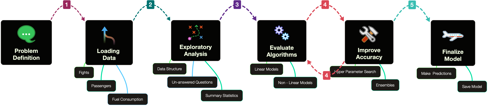
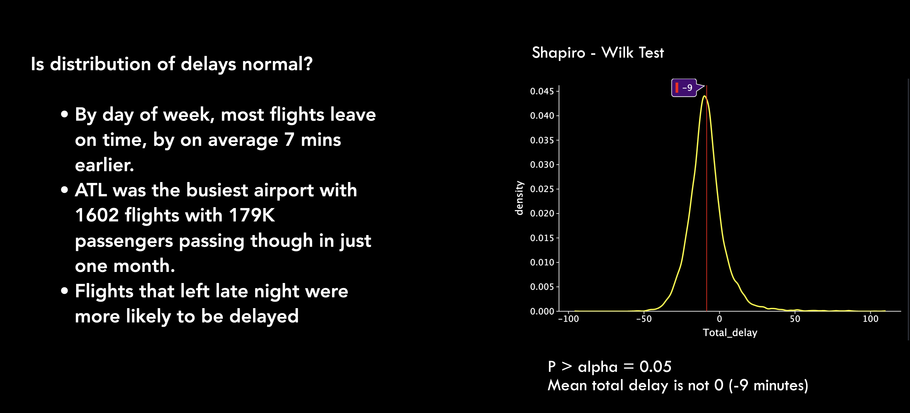
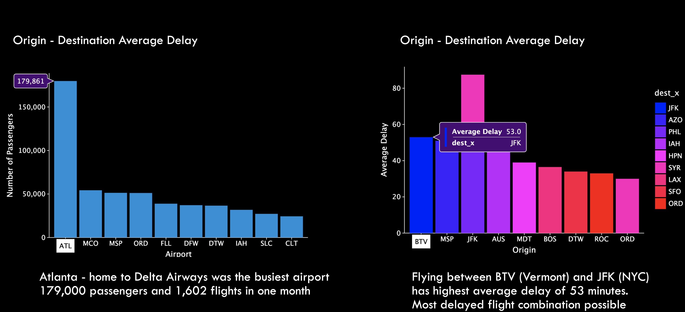
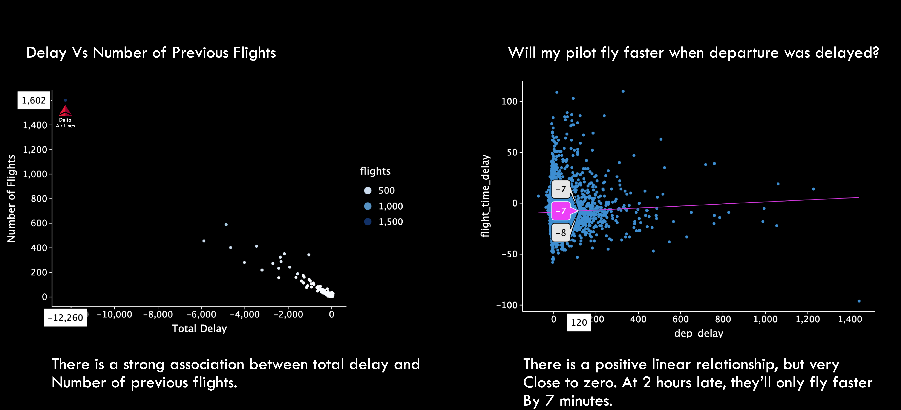

# Supervised Machine Learning: Predicting Flight Delays 

---
 
 
This repository contains all files rquired to reproduce and review the prediction model.
Credits to the following contributors:

- [**Shraddha Patel** ](https://github.com/SHRADDHAYOGIN/)
- [**Patrick Okwir** ](https://github.com/pokwir)

 
 

### Data
 
This model was trained using data colelcted from air travel in the United States between 2018 and 2019, it contains flights, fuel, and passenger data. 

|Dataset   | Description   |
|---|---|
|**flights**   |The departure and arrival information about flights in US in years 2018 and 2019.   |
|**fuel_comsumption**   |The fuel comsumption of different airlines from years 2015-2019 aggregated per month.   |
|**passengers**   |The passenger totals on different routes from years 2015-2019 aggregated per month.   |
| **flights Test**   |The departure and arrival information about flights in US in January 2020.   |

 
 
The submission CSV (link here) is a prediction of delays for the first 7 days of January 2020 (Jan 1 to 7).
 
 

For reproducibility, we have included a google drive link to raw data samples that can be used to follow/ reproduce the project. 
 

Enjoy!
 
 

## 1.Project Goals
 
 

 1.The primary objective of this project is to develop a predictive model  that can estimate arrival delays of commercial flights.
 2.The model should provide airlines with timely and accurate information to help them make informed decisions.
 3.By achieving accurate predictions, the project aims to improve customer satisfaction, optimize airline operations, and ultimately impact the profitability of airline agencies.

## 2. Process
 
 

- **Problem Definition:** For this project, we investigated flight delays in the United States between 2018 and 2019, we used this data to build and train the model. Each record in the flights dataset describes a flight. The artributes of each feature can be found in the [data description file](https://github.com/lighthouse-labs/mid-term-project-I/blob/master/data_description.md)
 

- **Loading the Dataset:** We connected to the AWS postgres database provided to fetch a sizable representative sample (95% confidence level) for all flights. The flight information was used to link to — [fuel consuption](https://github.com/lighthouse-labs/mid-term-project-I/blob/master/data_description.md), and [passengers](https://github.com/lighthouse-labs/mid-term-project-I/blob/master/data_description.md) tables. 
 

- **Exploratory Data Analysis:** This focused on structure, answering barinstormed exploratory questions, generating a data profile that would inform feature selection, normalization, and standardization procedures. 
 

- **Evaluate Algorithms:** This involved  finding a subset of machine learning algorithms that are good at exploiting the structure of our data and can best answer the hypothesis. This included seperating validation datasets, defining test options using scikit-learn such as cross validation and evaluation metrics to use, spot-checking a suite of linear and non linear models, and comparing estimated accuracy. 
 

- **Improving Accuracy:** Once a shorlist was finalized, we employed a search of tuning parameters using scikit-learn that would yield the best results and combined combined predictions of multiple models using ensemble. 
 

- **Finalizing the Model:** The best model was chosen. We made preditctions on the [flight test dataset]() and recorded our predictions in [this csv file](). Model was saved for future use. 
  

## 2. Results
 
 

 
 
 

• Grid Search for finding best hyper-parameters.

Best alpha for Ridge regression: 10.0

Best alpha for Lasso regression: 0.1

Best mean squared error for Ridge regression: 2331.9914636271724

Best mean squared error for Lasso regression: 2332.42623882772
 
 

• Use Ridge and Lasso Model.

• Use three Ensemble Techniques :
1) Random Forest Regressor
2) Gradient 
Boosting 
3) XGBoost 
 

• In which Random Forest Regressor gives minimum mean squared error
  
  Random Forest MSE: 1909.1760774350003

  With R2 of 0.10319376533141655
 

• Use linear regression model and find summary in which we observed
1) R2 of model is 0.1031937
2) Saturday has largest positive coefficient.
3.Monday has smallest negative coefficient.

